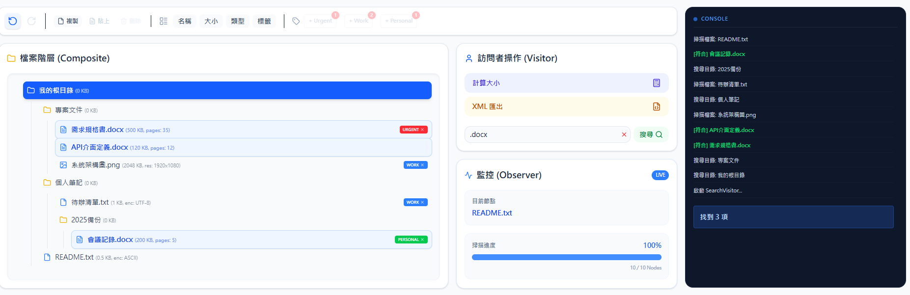
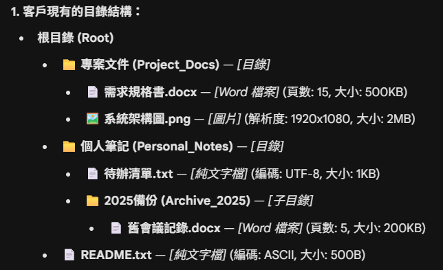
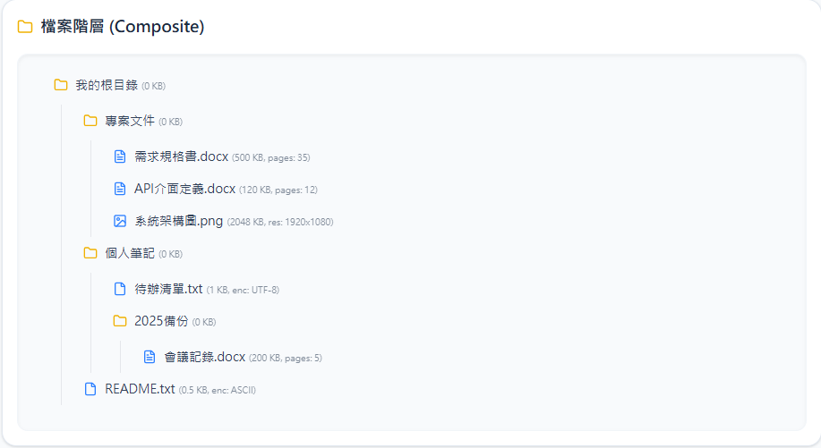
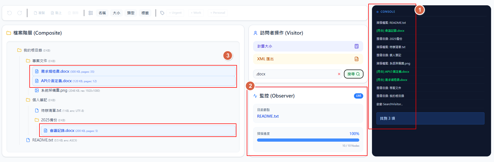
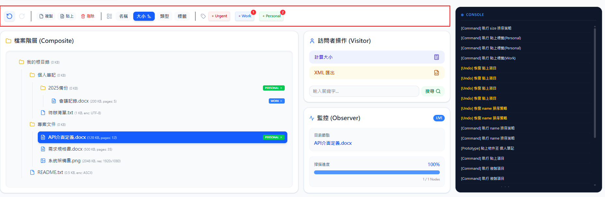

# 雲端檔案管理系統：領域模型分析與實作

## 作業說明

請完成下列作業，這將是我們評估您技術能力與架構思維的重要依據。

+ 不強制要求圖形介面 (GUI/Web)：作業重點在於物件導向分析與核心邏輯實作。結果呈現可使用 Console (終端機) 輸出 文字結果即可。當然，若您行有餘力完成 Web UI 亦可作為加分。
+ 工具使用： 本作業允許使用各類 AI 工具輔助開發。
+ 繳交方式： 請將程式碼上傳至 GitHub 並回傳連結，並且概述設計與實作概念。

## 一、考題背景

假設你是一名系統分析師 (SA)，今日與客戶進行了關於「雲端檔案管理系統」的需求訪談。
以下是訪談紀錄摘要：

+ 分析師： 您好，能請您描述一下這個系統主要管理什麼嗎？
+ 客戶： 主要是檔案。我們有很多不同類型的檔案要分類，最常見的有 **Word 文件**、**圖片**，還有一些簡單的 **純文字檔**。
+ 分析師： 這些檔案在系統裡有什麼共同點嗎？
+ 客戶： 當然，每個檔案都要有**檔名**，我們也要知道它的**大小 (KB)**以及它是**什麼時候建立**的。
+ 分析師： 那不同類型的檔案有什麼特別需要紀錄的資訊嗎？
+ 客戶： 喔有的！
  + 如果是 **Word** 檔，我們需要記錄它有幾頁；
  + 如果是 **圖片**，**解析度（寬跟高** 很重要；
  + 至於 **純文字檔**，我們通常會標記它是用哪種編碼存的，像是 UTF-8 之類的。

+ 分析師： 了解。那這些檔案是怎麼組織的？
+ 客戶： 我們用「**目錄**」來管理。一個目錄裡面可以放很多檔案。而且目錄裡面還可以再建立子目錄，就像 Windows 的資料夾那樣，可以一層套一層，沒有限制。
+ 分析師： 所以目錄本身也有名字吧？
+ 客戶： 對，目錄也有名字。另外要注意，所有的檔案都必須放在某個目錄下面，不能孤零零地存在外面。

## 二、交付任務

### UML 類別圖 (Domain Model)

根據上述對話內容與後續功能，推導出系統的**領域模型 (Domain Model)**。

+ 請繪製 **UML Class Diagram**。
+ 需呈現出類別之間的繼承 (Inheritance)、關聯 (Association) 或聚合 (Aggregation) 關係。

### Schema 設計

+ 請針對此檔案管理系統設計 ER Model 圖。

### 程式撰寫與實作

使用你擅長的程式語言（如 C#, Java, Python 或 TypeScript）完成實作。

+ 核心邏輯： 實作上述提到的檔案與目錄結構與其後續功能要求。
+ 功能要求： 請參考下列「實作功能」章節。
+ 輸出要求： 須能驗證功能執行結果（Console Log 或是 UI 呈現皆可）。



## 三、客戶提供的範例結構圖

請根據此結構進行建模與物件實作：
預期 Console 輸出長相：(圖中有小 Icon 可忽略)


```txt
根目錄 (Root)
├── 專案文件 (Project_Docs) [目錄]
│   ├── 需求規格書.docx [Word 檔案] (頁數: 15, 大小: 500KB)
│   └── 系統架構圖.png [圖片] (解析度: 1920x1080, 大小: 2MB)
├── 個人筆記 (Personal_Notes) [目錄]
│   ├── 待辦清單.txt [純文字檔] (編碼: UTF-8, 大小: 1KB)
│   └── 2025備份 (Archive_2025) [子目錄]
│       └── 舊會議記錄.docx [Word 檔案] (頁數: 5, 大小: 200KB)
└── README.txt [純文字檔] (編碼: ASCII, 大小: 500B)
```

## 四、實作功能要求

### 實作功能一：目錄結構呈現

1. 初始化： 請依照上述範例結構圖，建立物件實例。
2. 顯示： 能夠將完整的目錄結構與檔案詳細資訊（如頁數、解析度等）印出或顯示。



### 實作功能二：核心邏輯 (Console 呈現功能結果)

1. 遞迴計算總容量 (Calculate Total Size)
   + 需求： 實作一個方法，可以計算任一目錄及其下所有子目錄與檔案的「總大小」。
2. 副檔名搜尋功能 (Search by Extension)
   + 需求： 實作搜尋功能，輸入特定的副檔名（例如：.docx），系統需列出該目錄結構下所有符合條件的檔案路徑。
3. XML 結構輸出 (XML Serialization)
   + 需求： 提供一個方法，將目前的目錄結構轉換為 XML 格式 輸出。
   + 預期格式：

    ```xml
    <根目錄_Root>
        <專案文件_Project_Docs>
            <需求規格書_docx>頁數: 15, 大小: 500KB</需求規格書_docx>
            <系統架構圖_png>解析度: 1920x1080, 大小: 2MB</系統架構圖_png>
        </專案文件_Project_Docs>
        <個人筆記_Personal_Notes>
            <待辦清單_txt>編碼: UTF-8, 大小: 1KB</待辦清單_txt>
            <Archive_2025>
                <舊會議記錄_docx>頁數: 5, 大小: 200KB</舊會議記錄_docx>
            </Archive_2025>
        </個人筆記_Personal_Notes>
        <README_txt>編碼: ASCII, 大小: 500B</README_txt>
    </根目錄_Root>
    ```

### 實作功能三：功能進度追蹤 (Process Logging)

1. 演算法執行紀錄

+ 需求： 當執行「計算大小」或「搜尋」時，需在 Console 印出當前訪問的節點順序（Traverse Log），以證明程式是如何遍歷結構的。
+ 範例： Visiting: Root -> Project_Docs -> 需求規格書.docx ...



### 實作功能四：進階功能 (Bonus)

1. 排序功能： 可按 名稱、大小、副檔名 進行升冪或降冪排序。
2. 編輯功能： 實作節點的 刪除 或 複製／貼上。
3. 標籤功能： 針對項目貼標籤（Urgent 紅色、Work 藍色、Personal 綠色），並支援多重標籤。
4. 狀態管理 (Undo / Redo)： 實作操作的復原與重做機制。


